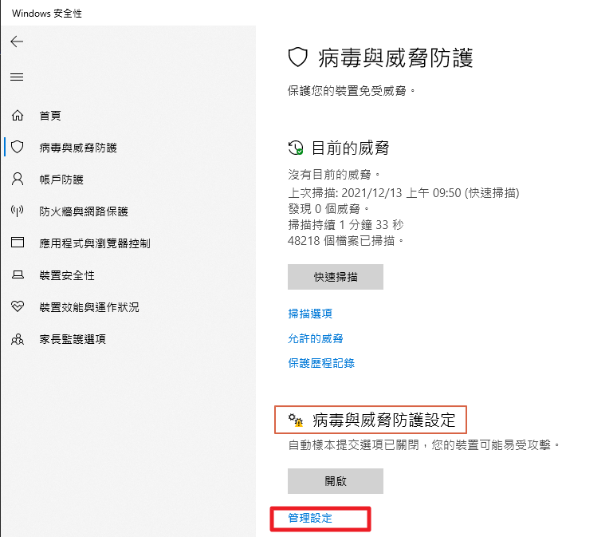
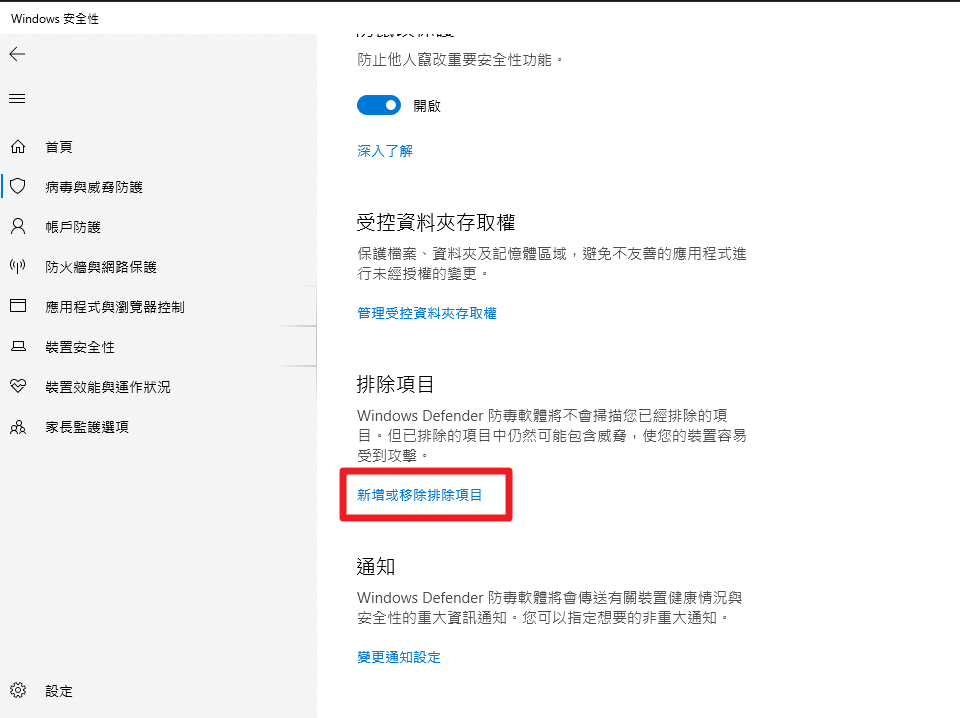
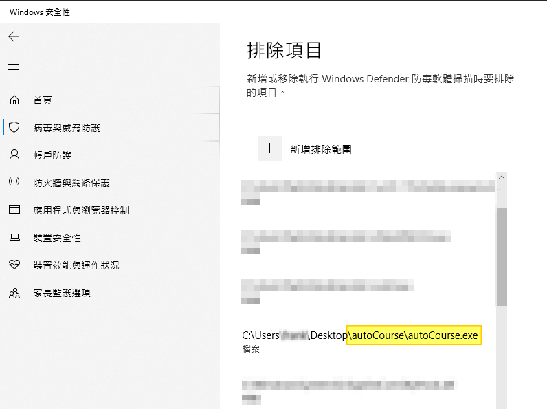

# 使用方式
    1. 至 https://ups.moe.edu.tw/mooc/index.php 進行選課
    2. 執行 autoCourse.exe 並鍵入帳號密碼
    3. 輸入圖形驗證碼
    4. 程式會開啟瀏覽器並跳轉到選課畫面，將實數未滿1hr的課程掛滿1hr

# 參考資料
|Hint|說明|參考|
|:--:|:--:|:--:|
|pip install PyInstaller|安裝PyInstaller||
|pyinstaller.exe -F .\autoCourse.py|打包exe|https://medium.com/pyladies-taiwan/python-%E5%B0%87python%E6%89%93%E5%8C%85%E6%88%90exe%E6%AA%94-32a4bacbe351|
|python3 -m PyInstaller myscript.py| 將PyInstaller當成module執行, 打包exe |https://stackoverflow.com/questions/53798660/pyinstaller-command-not-found|
|pip freeze ./requirements.txt   pip install -r ./requirements.txt|Python PIP 使用 requirements.txt 管理套件相依性|https://blog.longwin.com.tw/2019/03/python-pip-requirements-txt-management-package-2019/|

# 將exe加入windows defender例外

