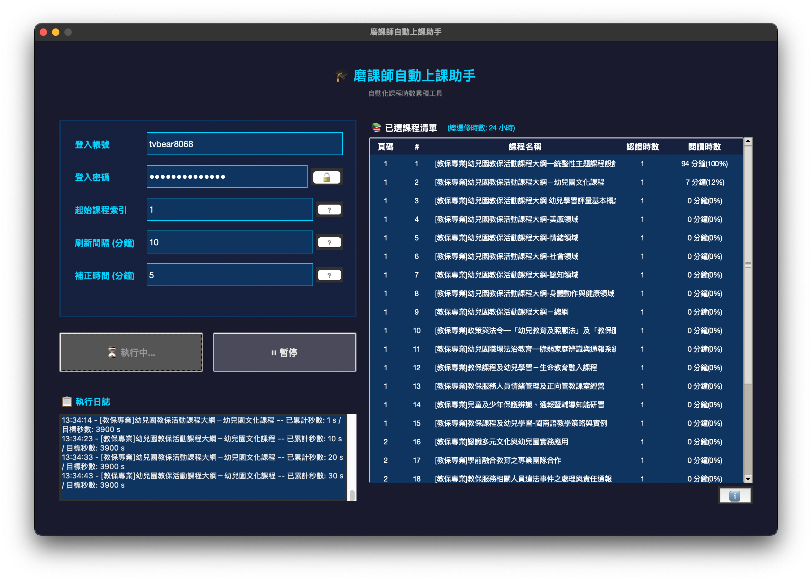

# 磨課師自動上課助手 (MOOCs Auto Course Assistant)

這是一個自動化的 Python 桌面應用程式，專為「磨課師 (MOOCs)」平台設計。透過簡單的圖形介面 (GUI)，協助使用者自動登入並依序完成課程時數的掛機任務。



## ⭐ 主要功能

### 🖥️ 友善的圖形介面 (GUI)
- **現代化深色主題**：採用舒適的深色背景設計 (`#1a1a2e`)，減少眼睛疲勞。
- **左右分欄佈局**：
  - **左側操作區**：設定帳號密碼、參數配置、控制按鈕與即時日誌。
  - **右側資訊區**：自動掃描並列出所有「進行中」的課程清單，即時計算總選修時數。
- **視窗自動置中**：啟動時自動鎖定於螢幕中央，並鎖定視窗大小 (1200x800) 以維持最佳版面。

### ⚙️ 彈性參數配置
- **起始課程索引**：可指定從第幾堂課開始執行（方便跳過需手動測驗的課程）。
- **刷新間隔**：設定自動重新整理頁面的時間，防止因閒置過久被登出。
- **補正時間**：自訂額外掛機時間，以補償網路延遲或渲染時間造成的時數誤差。
- **參數說明**：各設定欄位旁皆附有「?」說明按鈕，點擊即可查看詳細用途。

### 🤖 強大的自動化核心
- **自動登入**：支援教育雲端帳號登入流程。
- **圖形驗證碼輔助**：在登入按鈕上顯示倒數計時，預留時間供使用者手動輸入驗證碼。
- **多頁面掃描**：自動翻頁讀取所有課程資訊。
- **智慧掛機**：
  - 自動導航至課程頁面。
  - 檢測閱讀時數百分比，若達 100% 則提早結束。
  - 支援「暫停/繼續」功能，隨時掌控進度。

### 📝 完善的日誌系統
- **雙向同步記錄**：執行紀錄同時顯示於介面並寫入 `./autoCourse_logs/autoCourse.log` 檔案。
- **錯誤追蹤**：詳細記錄執行過程中的例外狀況，方便排查問題。

## 🛠️ 安裝與執行

### 環境需求
- Python 3.10+
- Google Chrome 瀏覽器

### 1. 安裝相依套件
請確保您已安裝 Python 虛擬環境工具 (推薦使用 `uv`)。

```bash
# 使用 pip
pip install -r requirements.txt

# 或使用 uv (推薦)
uv pip install -r requirements.txt
```

### 2. 啟動程式

```bash
# 直接執行 GUI 主程式
python guiCourse.py

# 或使用 uv
uv run python guiCourse.py
```

### 3. 打包為應用程式 (macOS)
若您希望將程式打包為可直接執行的 `.app` 應用程式，請執行以下步驟：

1. **賦予腳本執行權限**：
   ```bash
   chmod +x build_app.sh
   ```

2. **執行打包腳本**：
   ```bash
   ./build_app.sh
   ```
   > 此腳本會自動安裝 `pyinstaller` 並執行打包流程。

3. **執行應用程式**：
   打包完成後，應用程式位於 `dist/PeiPei-ECourse.app`。您可以直接雙擊執行，無需再透過終端機。
   *(註：打包後的日誌檔將儲存於應用程式同層目錄下的 `autoCourse_logs/` 資料夾中)*

## 📖 使用說明

1. **啟動程式**：執行後視窗將顯示於畫面中央。
2. **輸入資訊**：
   - **登入帳號/密碼**：輸入您的教育雲端帳號密碼（密碼欄位支援顯示/隱藏）。
   - **參數設定**：依需求調整「起始課程索引」、「刷新間隔」與「補正時間」。
3. **開始掛機**：
   - 點擊 **「🚀 開始自動上課」**。
   - 瀏覽器將自動啟動，請在登入頁面**手動輸入圖形驗證碼**並按 Enter（或等待倒數結束自動點擊）。
4. **執行過程**：
   - 程式會先掃描所有課程並顯示於右側清單。
   - 接著依序進入課程頁面掛機，直到達成目標時數。
   - 您可以隨時點擊 **「⏸ 暫停」** 來暫時停止自動化操作。

## 📂 檔案結構

- `guiCourse.py`: GUI 主程式入口。
- `autoCourse.py`: 自動化邏輯核心腳本 (CLI 版本)。
- `myUtils.py`: 共用工具函式庫 (Selenium 操作、邏輯判斷)。
- `base_logger.py`: 日誌系統配置。
- `autoCourse_logs/`: 存放執行日誌檔案。

## ⚠️ 免責聲明
本工具僅供學術研究與個人輔助使用，請勿用於任何違反平台服務條款之行為。開發者不對使用本工具造成的任何後果負責。
